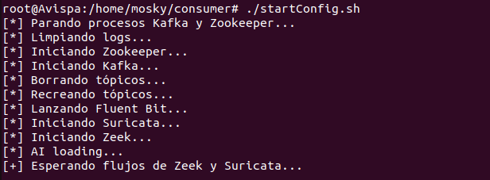
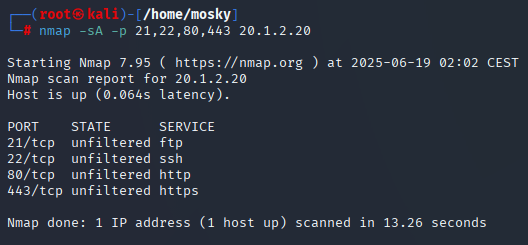
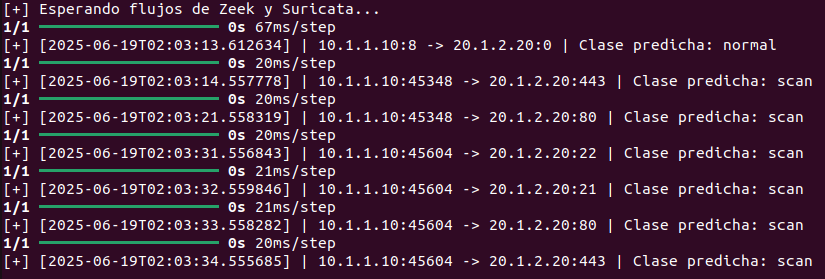
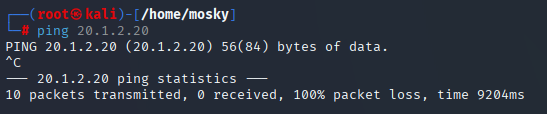
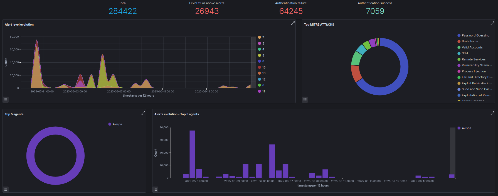
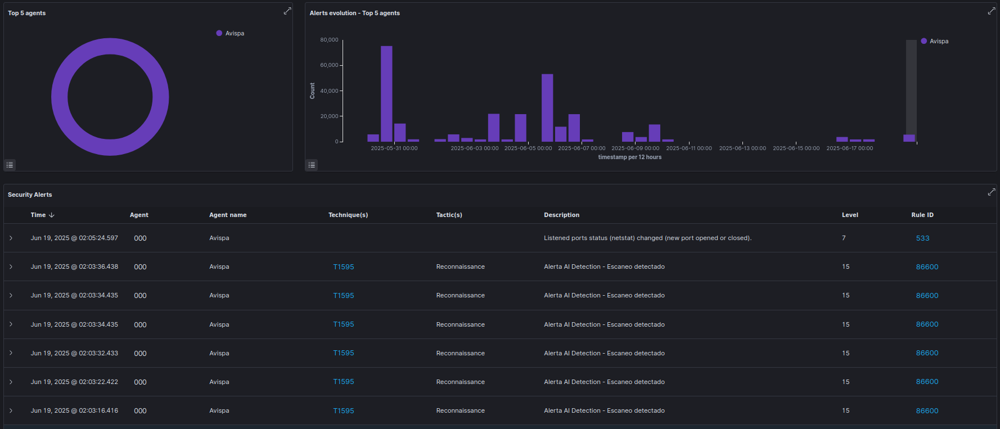

# Palo Bajo - NIDS

Sistema para la detección y prevención de intrusiones en redes mediante la aplicación de técnicas avanzadas de deep learning.

**Nota:** Este sistema se centra principalmente en la detección de técnicas de **Active Scanning** según la matriz MITRE ATT&CK, especialmente la técnica [T1595 - Active Scanning](https://attack.mitre.org/techniques/T1595/).

## [+] Resumen

Sistema IDS/IPS que utiliza un modelo de clasificación binaria basado en una red neuronal tipo Multilayer Perceptron (MLP), entrenado con tráfico de red realista. Integra captura de paquetes, análisis de flujos (Zeek, Suricata), procesamiento en tiempo real (Kafka, Fluent Bit) y alertas SIEM (Wazuh).

**Enfoque:** El sistema se centra en la detección basada en comportamiento y características de flujo, no en firmas específicas. Por tanto, el modelo no utiliza ni puertos ni direcciones IP para realizar la clasificación, priorizando la generalización frente a patrones estáticos.

## [+] Prueba de concepto

Esta demostración muestra paso a paso el funcionamiento del sistema IDS/IPS desde el despliegue hasta la detección y bloqueo de ataques.

### 1. Despliegue de la infraestructura

<p align="center">
  
</p>
<p style="text-align: left; margin-top: 0; margin-bottom: 1em;">
  <em>Ejecución del script <code>startConfiguration.sh</code>, que inicia Kafka, Zookeeper, Fluent Bit, Suricata, Zeek y el consumidor AI para procesamiento en tiempo real.</em>
</p>

### 2. Ataque scan ACK desde Kali

<p align="center">
  
</p>
<p style="text-align: left; margin-top: 0; margin-bottom: 1em;">
  <em>Kali realiza un escaneo ACK dirigido a la máquina víctima para detectar puertos abiertos.</em>
</p>

### 3. Clasificación en tiempo real del modelo

<p align="center">
  
</p>
</p>
<p style="text-align: left; margin-top: 0; margin-bottom: 1em;">
  <em>Visualización de la salida del consumidor AI: se observa un primer ping detectado como tráfico normal, y el resto de flujos correctamente clasificados como escaneo (<code>scan</code>).</em>
</p>

### 4. Bloqueo de ping desde Kali a la víctima

<p align="center">
  
</p>
<p style="text-align: left; margin-top: 0; margin-bottom: 1em;">
  <em>Kali no recibe respuesta del ping a la víctima tras aplicar reglas <code>iptables</code> por detección previa del escaneo.</em>
</p>

### 5. Wazuh Dashboard (vista 1)

<p align="center">
  
</p>
<p style="text-align: left; margin-top: 0; margin-bottom: 1em;">
  <em>Panel de alertas en Wazuh mostrando eventos generados por la detección del escaneo, con detalles contextualizados.</em>
</p>

### 6. Wazuh Dashboard (vista 2)

<p align="center">
  
</p>
<p style="text-align: left; margin-top: 0; margin-bottom: 1em;">
  <em>Vista detallada de las alertas en Wazuh, con información de MITRE ATT&CK sobre la técnica y táctica detectadas.</em>
</p>

## [+] Cómo usar

1. Clonar el repositorio:

```bash
git clone https://github.com/M0sky/Palo-Bajo-NIDS.git
cd Palo-Bajo-NIDS
```

2. Descargar archivos grandes con Git LFS:

```bash
git lfs install
git lfs pull
```

3. Configurar la topología en GNS3 (ver carpeta [`myLab`](./myLab/) y ZIP adjunto).
4. Preparar la máquina ubuntu donde se despliega el IDS/IPS, habiendo instalado y configurado las siguientes herramientas:
    - **Apache Kafka y Zookeper**: Crear y configurar los tópicos zeek-flows y suricata-flows.
    - **Fluent Bit**: Empleado para leer logs de Suricata y Zeek y enviarlos a Kafka. Archivo de configuración: [`deployment/fluent-bit/td-agent-bit.conf`](./deployment/fluent-bit/td-agent-bit.conf).
    - **Suricata**: Utilizado para asegurar la consistencia de los flujos. Archivo de configuración: [`deployment/suricata/suricata.yaml`](./deployment/suricata/suricata.yaml).
    - **Zeek**: Utilizado para análisis de flujos (TCP flags y estado de la conexion).
    - **Wazuh**: Plataforma SIEM para monitorizar alertas.

5. Ejecutar el script de despliegue ([`deployment/scripts/startConfiguration.sh`](./deployment/scripts/startConfiguration.sh).
6. Generar escaneos y ataques desde Kali Linux para probar el sistema.
7. Monitorizar alertas y eventos en Wazuh.

## [+] Estructura del repositorio

- `myLab/`: Topología en GNS3.
- `labeling/`: Pipeline para generación de datasets etiquetados a partir de las capturas PCAP.
- `training/`: Scripts de preprocesado y entrenamiento del modelo de clasificación binario.
- `deployment/`: Configuraciones y scripts para despliegue en tiempo real del sistema.
