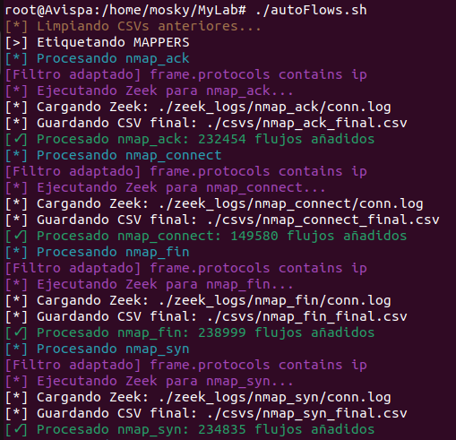

# Pipeline de Etiquetado Automático - Labeling

Este módulo forma parte del sistema IDS/IPS basado en Deep Learning desarrollado en el laboratorio `myLab`. Contiene los scripts necesarios para procesar capturas .pcap, extraer características mediante Zeek y generar datasets etiquetados para entrenamiento y validación de modelos de clasificación.

---

## [+] Captura del proceso

---

## [+] Funcionamiento del pipeline

1. Archivos `.pcap` organizados en las carpetas adecuadas dentro de `./traffic/`.

2. Ejecutar el script principal con `./autoflows.sh`.

Esto realiza automáticamente:

- Fusión y filtrado de los PCAPs con mergecap y tshark
- Análisis del tráfico con Zeek (`conn.log`)
- Parsing y etiquetado con `zeekParser.py`
- Generación del dataset final `dataset.csv`

---

## [+] Evolución del sistema

**Primera versión (solo Argus)**
- Extracción de flujos con `argus` y `ra`
- Información de flags TCP mediante `tcpFlags.py`

**Versión intermedia (Argus + Zeek)**
- Enriquecimiento de flujos combinando datos de ambos sistemas
- Mayor calidad, pero más complejidad

**Versión final (solo Zeek)**
- Uso exclusivo de Zeek para extraer los flujos
- Flags derivadas del campo `history`
- `conn_state` utilizado como feature categórica
- Pipeline más limpio y mantenible.

---

## [+] Tipos de tráfico generados

**Escaneos Nmap (label: 1, category: scan)**
- Técnicas como SYN, ACK, FIN, NULL, XMAS, CONNECT...
- Variantes automatizadas con `mapping.sh`

**Tráfico normal (label: 0, category: normal)**
- Sesiones legítimas FTP, SSH, HTTP, DNS, ICMP, SMB, RDP...
- Generado en escenarios controlados dentro de GNS3

---

## [+] Tecnologías utilizadas

- **Argus**: Recolección inicial de flujos.
- **Zeek**: Extracción final de características.
- **Nmap**: Generación del tráfico de escaneo mediante variantes automatizadas usando  `mapping.sh`.