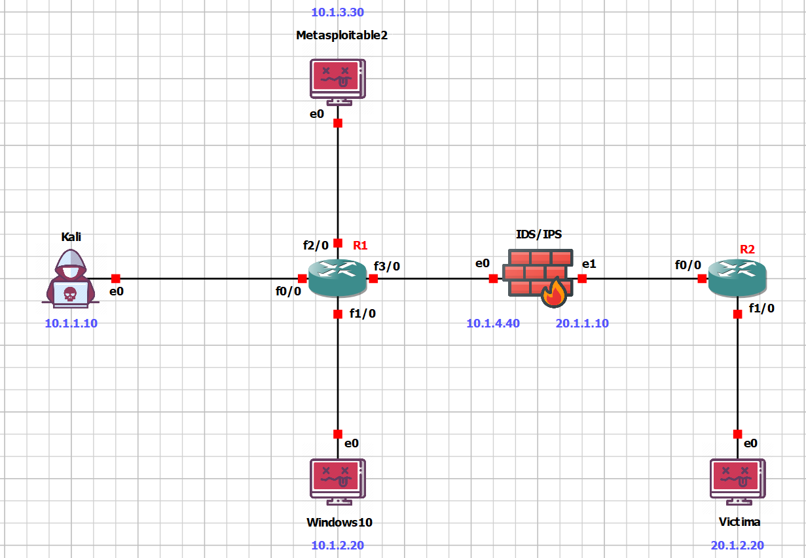

# Laboratorio de red - GNS3 (myLab)

Este laboratorio ha sido diseñado como entorno de pruebas para el desarrollo de un sistema IDS/IPS basado en Deep Learning, utilizando GNS3, máquinas virtuales y routers Cisco. El sistema ha sido entrenado con flujos de red capturados en un entorno personal controlado, por lo que su rendimiento está optimizado para este contexto y puede no generalizar a otras redes sin ajustes.

## [+] Topología del entorno

## [+] Componentes del entorno

### [>] Zona Externa (Redes 10.1.X.0/24)
- **Kali Linux** (`10.1.1.10`): Máquina atacante para generar tráfico malicioso.
- **Windows 10** (`10.1.2.20`): Máquina víctima para pruebas de ataques dirigidos (IIS, RDP...).
- **Metasploitable2** (`10.1.3.30`): Sistema vulnerable con varios servicios inseguros expuestos.
- **R1**: Router Cisco 7200 que conecta la zona externa con el IDS/IPS y realiza el enrutamiento entre las distintas subredes.

### [>] IDS/IPS

- **Ubuntu**: Máquina con el IP forwarding activado para ver los flows completos mediante dos interfaces.
  - IP interna: `10.1.4.40`
  - IP externa: `20.1.1.10`

### [>] Zona interna (Redes 20.1.X.0/24)
- **R2**: Segundo router Cisco 7200, conecta el IDS/IPS con la red víctima.
- **Máquina Víctima** (`20.1.2.20`): Simula un host en la red interna, objetivo de los ataques o tráfico legítimo.

## [+] Tecnologías utilizadas

- **GNS3**: Simulación completa de la topología de red.
- **Suricata / Zeek**: Recolección de flujos y eventos de red.
- **Apache Kafka**: Sistema de colas para el procesamiento en tiempo real.
- **Fluent Bit**: Ingesta de logs desde los sensores al bus de datos.
- **TensorFlow / Keras**: Modelo multiclase de detección de intrusiones en tiempo real.
- **Wazuh**: Plataforma SIEM para detección, alertas y monitoreo.
- **Wireshark**: Captura y análisis de tráfico.

## [+] Verificación de rutas

