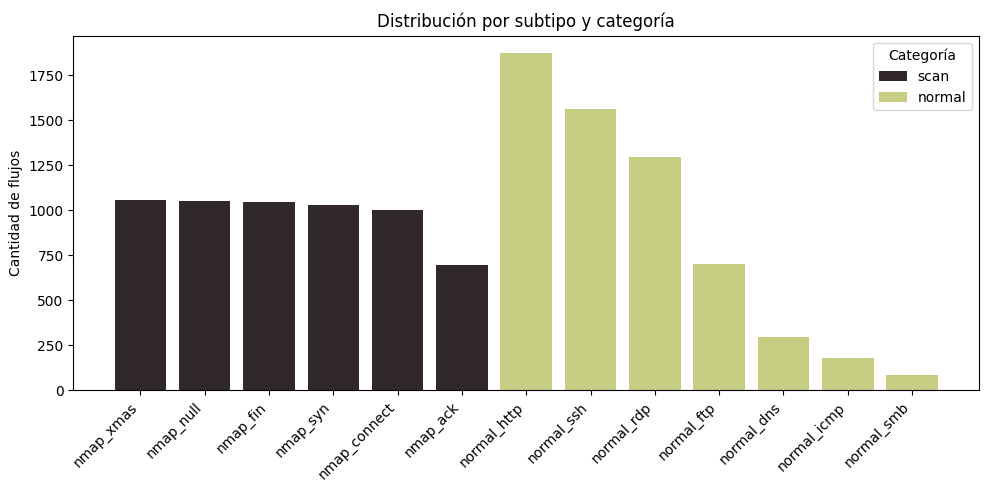
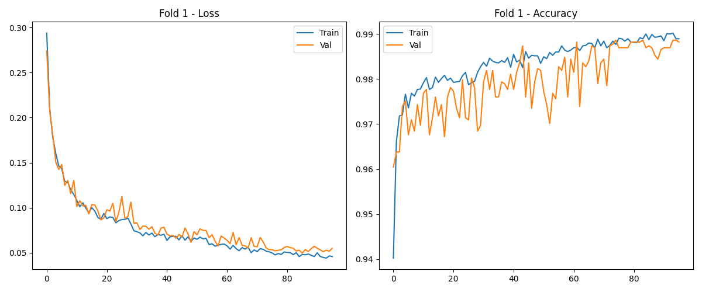
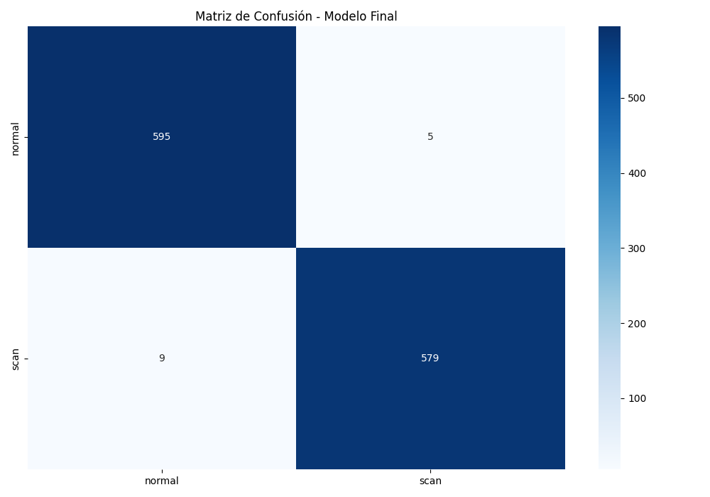
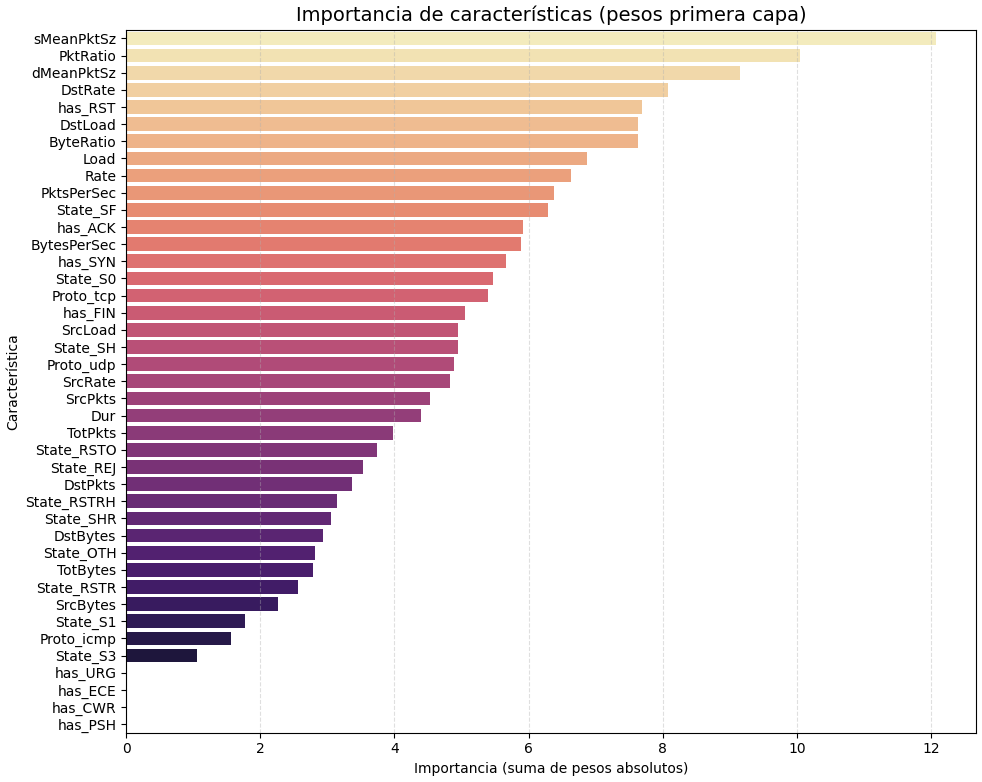

# Preprocesado y entrenamiento

Esta sección contiene los scripts y recursos necesarios para el preprocesado de datos y el entrenamiento del modelo.

## [+] Contenido principal

- **preprocesado.py**: Limpieza, balanceo y generación final del dataset.
- **entrenamiento.py**: Entrenamiento con validación cruzada y modelo final, incluyendo generación de métricas y gráficas.
- **images/**: Gráficos relevantes del proceso, incluyendo:
  - Curvas de entrenamiento por fold.
  - Matrices de confusión.
  - Importancia de características.
  - Distribución de clases y balance del dataset.

## [+] Funcionamiento del pipeline

1. Ejecutar `preprocesado.py` para preparar el dataset balanceado y limpio, listo para entrenar.
2. Ejecutar `entrenamiento.py` para entrenar el modelo, validar y guardar:
   - Modelo entrenado (`modelo_FINAL.keras`)
   - Pipeline de preprocesado (`preprocessing_pipeline_FINAL.pkl`)
   - Codificador de etiquetas (`label_encoder_FINAL.pkl`)
3. Revisar las gráficas en la carpeta `images/` para análisis visual y validación.

## [+] Visualización de distribuciones, métricas y rendimiento

### Distribución del dataset tras el preprocesado

*Esta gráfica muestra la distribución balanceada de las distintas clases y subtipos tras el preprocesado, garantizando diversidad y proporcionalidad.*

### Curvas de entrenamiento por fold

  
*Ejemplo de curvas de pérdida y precisión en el Fold 1.*

*(Se generan curvas similares para cada fold mostrando la estabilidad y evolución del entrenamiento.)*

### Matriz de confusión final

*La matriz de confusión del modelo final entrenado en el 90% del dataset y evaluado en el 10% restante.*

### Importancia de características

*Visualización de la contribución relativa de cada feature en la primera capa del modelo, que ayuda a interpretar qué atributos son más decisivos para la clasificación.*

### [+] Métricas finales

El modelo logra un excelente rendimiento con:

| Clase   | Precision | Recall | F1-score | Soporte |
|---------|-----------|--------|----------|---------|
| normal  | 0.99      | 0.99   | 0.99     | 600     |
| scan    | 0.99      | 0.98   | 0.99     | 588     |
| **Accuracy**  |       |        | **0.99** | 1188    |

He utilizado distintas técnicas de preprocesado y regularización para garantizar robustez y evitar sobreajuste.

## [+] Tecnologías utilizadas

- **TensorFlow / Keras**: Modelado y entrenamiento de red neuronal.
- **Scikit-learn**: Preprocesado, validación cruzada y métricas.
- **Matplotlib / Seaborn**: Visualización de resultados y análisis.
- **Joblib / Pickle**: Serialización de modelos y objetos.